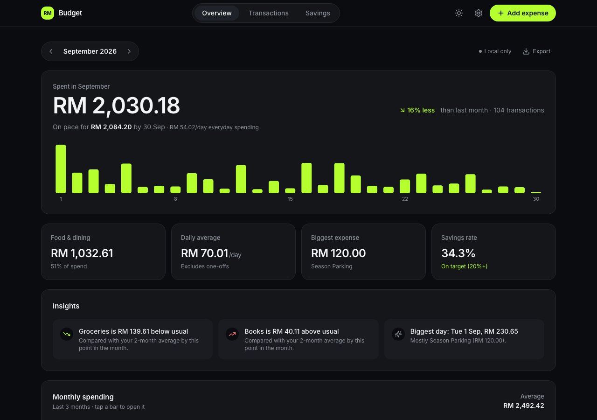
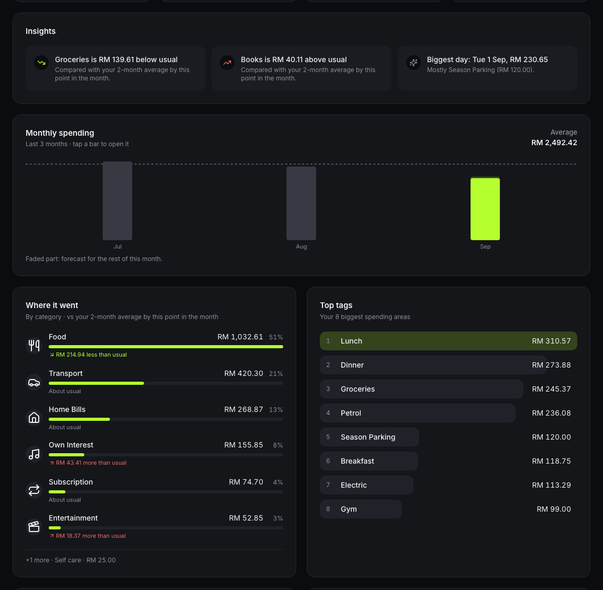
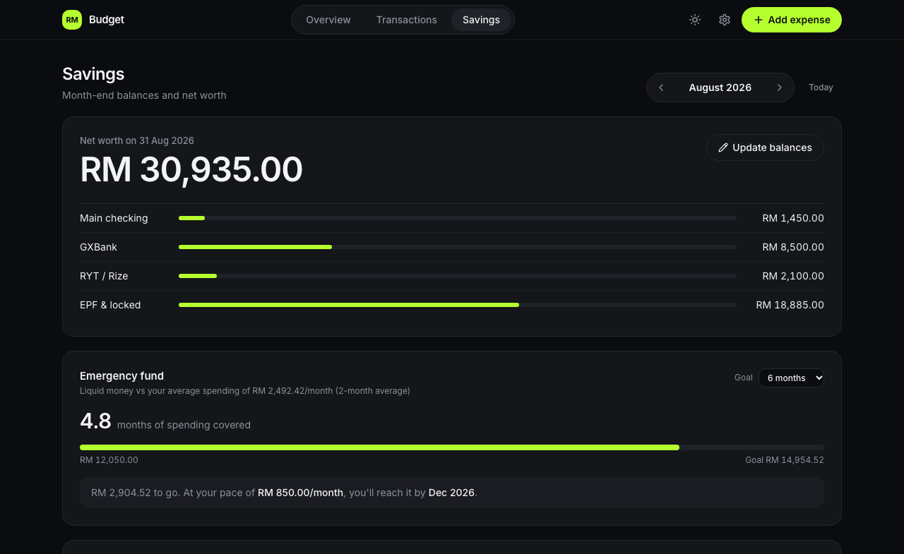
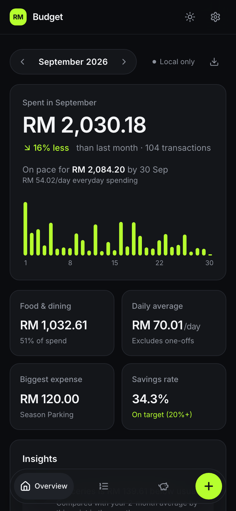
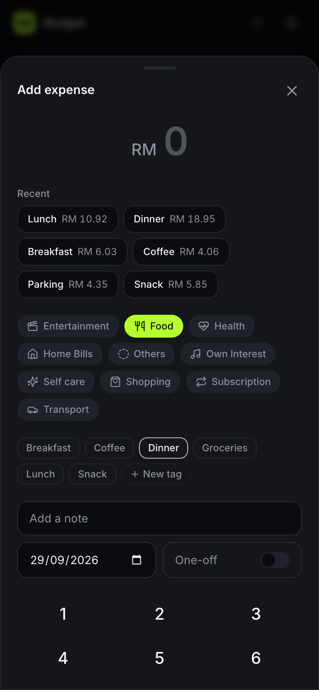

# 💰 Personal Monthly Budget & Wealth Tracker (Web & Mobile PWA)

A full-stack, mobile-first personal finance app that replaced my Excel budget sheet: log an expense in a few taps on the phone, and get the analytics a spreadsheet never gave me — where the month is heading, what's unusual, which bills are still unpaid and how long my savings would last.

Hosted $100\%$ free on **Vercel** and **Supabase (PostgreSQL)** with no expiring trial periods or server costs.

## 👀 Try It Without an Account

**Live app: [budget-tracker-gold-sigma.vercel.app](https://budget-tracker-gold-sigma.vercel.app)**

On the sign-in page, choose **Continue without an account**. You get the full app with made-up sample data:

- Add, edit and delete expenses, set up monthly bills, categories and savings balances
- Explore the analytics: month-end forecast, insights, spending calendar, savings rate and emergency fund
- Works on your phone too, and can be added to the home screen

Guest mode never touches the database and stores nothing in your browser, so **nothing you enter is saved**: a refresh starts over.

## 📸 Screenshots

| Overview | Analytics |
| :---: | :---: |
|  |  |

| Savings | Mobile | Add expense |
| :---: | :---: | :---: |
|  |  |  |

*All screenshots use the app's made-up demo data.*

---

## 📱 Highlights & Features

### ⚡ Fast entry
- **Add an expense in a few taps**: numpad sheet, **Recent** shortcuts (tag + last amount), and a tag picked for the time of day (breakfast, lunch, dinner…).
- **Edit or delete** any entry, with a 5-second **Undo**; failed saves roll back with **Retry**.
- **Your own categories and tags** (with icons), created in Settings or on the spot while adding.
- Installable **PWA** for iOS/Android home screens; keyboard entry on desktop.

### 📊 Analytics
- **Month-end forecast**: "On pace for RM 2,084 by 30 Sep", from everyday spending plus bills still to come.
- **Compared with usual**: each category against its 3-month average (pro-rated for the current month).
- **Insights**: plain-English highlights such as tags above or below usual, no-spend days and weekend-heavy spending.
- **Monthly trend**, **spending calendar** (days shaded by spend), **fixed vs flexible** split and **year to date**.

### 🧾 Monthly bills
- Choose which tags are monthly bills, with an optional **expected amount** and **due day**.
- Overview shows **Logged / Due in 2 days / Overdue / Missing**, and logs unpaid bills in one tap.
- **Auto-add** fixed bills on their due day via a daily **pg_cron** job in Postgres.

### 🚦 Budgets & reminders
- **Monthly budget per category**: Overview shows spend against each limit, the pace ("on pace for RM 430"), what's left per day, and flags budgets at risk or over.
- **Phone notifications** around 8pm: bills due tomorrow or overdue, goal vouchers about to expire, budgets at 80% or over, and an optional "nothing logged today" nudge. Each is sent once; Settings shows a preview of what would go out tonight.

### 🏦 Savings & salary
- **Malaysian salary engine**: EPF, SOCSO and EIS deductions, take-home pay and savings rate (editable).
- **Month-end balances** per account with daily-compounded interest estimates (GXBank, RYT).
- **Emergency fund**: months of spending covered, a goal, and when you'll reach it at your pace.
- **Where it changed**: balance changes by account, the **untracked cash** check (growth vs. what the budget says you saved) and **savings rate by month**.

### 🎯 Goals
- Save toward things you want: progress, "set aside RM X/month to make it by <date>" with **on track / behind**, or when you'll be ready at your pace.
- **Trade-in value** and **discounts & vouchers** (RM or %, with expiry dates) come off the target; expiring vouchers are flagged, expired ones stop counting.
- **Bought it** logs what you paid as a one-off expense; money set aside for goals is kept separate from your emergency fund.

### 🔐 Data & privacy
- **Email + password sign-in**, no public sign-up; every table locked with owner-only **Row-Level Security**.
- **Guest mode** with generated demo data, isolated from the database.
- **Export**: month or all expenses as Excel-friendly CSV, savings balances, or a full JSON backup.
- Refined dark theme with a light mode, and layouts that adapt to touch and mouse.

---

## 🛠️ Tech Stack

- **Frontend & App Framework**: [Next.js 15 (App Router)](https://nextjs.org/) + [React 19](https://react.dev/)
- **Styling & UI**: [Tailwind CSS](https://tailwindcss.com/) + [Lucide Icons](https://lucide.dev/) + Inter font
- **Charts & Visualizations**: [Recharts](https://recharts.org/) plus custom accessible bar lists and a calendar heatmap
- **Database & Authentication**: [Supabase (PostgreSQL)](https://supabase.com/) with Row-Level Security (RLS) and `pg_cron`
- **PWA Integration**: Web App Manifest and home-screen icons
- **Quality**: TypeScript, ESLint, formula parity tests, GitHub Actions CI
- **Hosting**: [Vercel](https://vercel.com/) (free Hobby tier)

---

## 🏗️ Architecture Overview

```
┌─────────────────────────────────────────────────────────────┐
│                       CLIENT TIER                           │
│  📱 Mobile PWA (Add to Home Screen)  |  💻 Desktop Browser  │
└──────────────────────────────┬──────────────────────────────┘
                               │ HTTPS / JSON
┌──────────────────────────────▼──────────────────────────────┐
│                  APPLICATION TIER (VERCEL)                  │
│  • Next.js App Router (No cold starts, 0 server cost)       │
│  • Salary, Interest & Daily Burn Rate Math Engines         │
│  • Optimistic UI Updates (< 1ms)                            │
│  • Vercel Cron: daily reminders via Web Push (8pm MYT)      │
└──────────────────────────────┬──────────────────────────────┘
                               │ Authenticated REST API
┌──────────────────────────────▼──────────────────────────────┐
│                  DATABASE TIER (SUPABASE)                   │
│  • PostgreSQL 16 Relational Engine                          │
│  • Row-Level Security (RLS) Policies                        │
│  • pg_cron: daily auto-add of due monthly bills             │
└─────────────────────────────────────────────────────────────┘
```

---

## 🗄️ Database Schema & Setup

### 1. Initial Tables Setup
Execute the following SQL in your **Supabase SQL Editor**:

```sql
-- 1. Enable UUID Extension
create extension if not exists "uuid-ossp";

-- 2. User Profiles & Salary Defaults
create table public.user_profiles (
  id uuid references auth.users on delete cascade primary key,
  email text,
  default_gross_salary numeric(10, 2) default 3500.00,
  epf_rate numeric(5, 4) default 0.1100,
  socso_rate numeric(10, 2) default 17.25,
  eis_rate numeric(10, 2) default 6.90,
  created_at timestamptz default now()
);

-- 3. Categories Taxonomy
create table public.categories (
  id uuid primary key default uuid_generate_v4(),
  name text not null unique,
  color text default '#3b82f6',
  icon text -- lucide icon key chosen in Settings; NULL = default by name
);

-- 4. Tags Taxonomy (Linked to Categories)
create table public.tags (
  id uuid primary key default uuid_generate_v4(),
  category_id uuid references public.categories(id) on delete cascade not null,
  name text not null,
  unique(category_id, name)
);

-- 5. Transactions Ledger
create table public.transactions (
  id uuid primary key default uuid_generate_v4(),
  user_id uuid references auth.users on delete cascade,
  date date not null default current_date,
  category_id uuid references public.categories(id) not null,
  tag_id uuid references public.tags(id) not null,
  amount numeric(10, 2) not null check (amount > 0),
  description text,
  is_one_off boolean not null default false,
  created_at timestamptz default now()
);

create index idx_transactions_user_date on public.transactions(user_id, date);

-- 6. Monthly Savings Snapshots
create table public.monthly_savings (
  id uuid primary key default uuid_generate_v4(),
  user_id uuid references auth.users on delete cascade,
  month date not null, -- Stored as YYYY-MM-01
  main_checking numeric(12, 2) default 0.00,
  gx_bank numeric(12, 2) default 0.00,
  gx_rate numeric(5, 4) default 0.0355,
  ryt_bank numeric(12, 2) default 0.00,
  ryt_rate numeric(5, 4) default 0.0000,
  epf_locked numeric(12, 2) default 0.00,
  unique(user_id, month)
);

-- 7. Recurring Bills Sentinel Configuration
create table public.recurring_sentinel (
  id uuid primary key default uuid_generate_v4(),
  user_id uuid references auth.users on delete cascade,
  tag_id uuid references public.tags(id) not null,
  is_active boolean default true
);

-- 8. Row-Level Security (RLS) Policies
alter table public.user_profiles enable row level security;
alter table public.categories enable row level security;
alter table public.tags enable row level security;
alter table public.transactions enable row level security;
alter table public.monthly_savings enable row level security;

create policy "Allow public read categories" on public.categories for select using (true);
create policy "Allow public read tags" on public.tags for select using (true);
create policy "Allow all transactions access" on public.transactions for all using (true) with check (true);
create policy "Allow all savings access" on public.monthly_savings for all using (true) with check (true);
```

### 2. Import Your Spreadsheet (optional)
To bring in history from an Excel budget sheet (same layout as `Monthly Budget.xlsm`):
1. Generate a seed script from your file:
   ```bash
   python3 scripts/migrate_excel.py "path/to/Monthly Budget.xlsm"
   ```
   This writes `scripts/seed_data.sql` (categories, tags, transactions and savings snapshots).
2. Paste it into the Supabase SQL Editor and click **Run**.

Your spreadsheet and the generated `seed_data.sql` contain real financial data, so both are **gitignored**; keep them out of the repository.

Without a spreadsheet, the app still works: add categories and tags in **Settings**, or try it first with **Continue without an account** (sample data, nothing saved).

### 3. Lock the Database to Your Account
The seed script opens the tables so data can be loaded. Close them afterwards:
1. Supabase Dashboard → **Authentication → Users → Add user → Create new user** with your email and a strong password (tick **Auto Confirm User**).
2. **Authentication → Sign In / Providers → Email** → turn off **Allow new users to sign up**.
3. Set your email in [`scripts/secure_rls.sql`](scripts/secure_rls.sql) and run it in the SQL Editor.

This assigns all data to your user and replaces every policy with owner-only RLS (categories and tags stay editable by the signed-in owner from **Settings → Categories & tags**). The app then requires sign-in (`/login`). **Do not re-run `seed_data.sql` afterwards**; it re-opens the tables.

### 4. Migrations
One-off SQL changes for existing databases live in [`scripts/migrations/`](scripts/migrations/). Run each new file once in the SQL Editor, in date order:
- `2026-09-28_manage_categories_tags.sql`: adds `categories.icon` and lets the owner add, rename and delete categories and tags.
- `2026-09-28_monthly_bills.sql`: adds expected amount and due day to `recurring_sentinel`, one row per bill, and carries over the 8 bills the app used to hard-code.
- `2026-09-28_auto_bills.sql`: per-bill "Add automatically" switch and a daily `pg_cron` job (00:05 Malaysia time) that adds due auto bills. Needs the `pg_cron` extension (Dashboard → Database → Extensions).
- `2026-09-28_emergency_goal.sql`: adds `user_profiles.emergency_months` (emergency fund goal on the Savings page, default 6).
- `2026-09-29_goals.sql`: `goals` (targets with optional trade-in and discounts) and `goal_contributions` (money set aside) tables, owner-only RLS. Re-runnable: running it again adds anything new.
- `2026-09-29_budgets.sql`: `budgets` table (monthly limit per category), owner-only RLS.
- `2026-09-29_reminders.sql`: `push_subscriptions` (devices), `reminder_settings` (which reminders) and `reminder_log` (what was already sent) for phone notifications. See [Reminders](#5-reminders-optional).

---

## 🚀 Getting Started Locally

### 1. Prerequisites
- **Node.js**: v20+ or v22+
- **Git**
- A free account on [Supabase](https://supabase.com)
- A free account on [Vercel](https://vercel.com)

### 2. Install Dependencies
```bash
npm install
```

### 3. Configure Environment Variables
Create `.env.local` in your root directory:

```env
NEXT_PUBLIC_SUPABASE_URL=https://your-project-id.supabase.co
NEXT_PUBLIC_SUPABASE_ANON_KEY=your-anon-public-key
```

### 4. Available Commands
```bash
npm run dev         # Start local development server on http://localhost:3000
npm run type-check  # Verify TypeScript compilation (tsc --noEmit)
npm run lint        # ESLint (flat config in eslint.config.mjs)
npm test            # Formula parity with Excel (scripts/test_formulas.mjs)
npm run build       # Build optimized Next.js production bundle
```

### 5. Reminders (optional)
Phone notifications are sent by a daily Vercel Cron job (`vercel.json`, 12:00 UTC = 8pm Malaysia time) that calls `/api/reminders`. To turn them on:

1. Run `scripts/migrations/2026-09-29_reminders.sql` in the Supabase SQL Editor.
2. Generate a key pair: `npx web-push generate-vapid-keys`.
3. Add these environment variables in Vercel (Project → Settings → Environment Variables), then redeploy:

   | Variable | Value |
   | --- | --- |
   | `NEXT_PUBLIC_VAPID_PUBLIC_KEY` | Public key from step 2 |
   | `VAPID_PRIVATE_KEY` | Private key from step 2 |
   | `SUPABASE_SERVICE_ROLE_KEY` | Supabase → Project Settings → API keys → `service_role` (server only, never `NEXT_PUBLIC_`) |
   | `CRON_SECRET` | Any long random string, e.g. `openssl rand -hex 32`. Vercel sends it to the cron route; other callers get 401. |

4. On each device: **Settings → Reminders → Turn on**, then **Send a test**. On iPhone/iPad (iOS 16.4+) this only works from the Home Screen app, not a Safari tab.

To run the job by hand: `curl -H "Authorization: Bearer $CRON_SECRET" https://<your-app>/api/reminders`.

---

## 📱 Mobile PWA Installation Guide

1. Deploy your app to **Vercel** (connect GitHub repository $\to$ click **Deploy**).
2. Open your deployed URL on your phone:
   - **iOS (Safari)**: Tap the **Share** button $\to$ tap **"Add to Home Screen"**.
   - **Android (Chrome)**: Tap the **Three Dots Menu** $\to$ tap **"Install App"** or **"Add to Home screen"**.
3. Launch from your home screen. It will open full-screen without browser URL bars, exactly like a native app.

---

## 📐 Core Financial Formulas

| Metric | Formula |
| :--- | :--- |
| **Net Salary** | $\text{Gross} - (\text{Gross} \times 0.11) - 17.25 - 6.90$ |
| **Net Cash Saved** | $\text{Net Salary} - \text{Total Spend}$ |
| **Savings Rate** | $\frac{\text{Net Cash Saved}}{\text{Net Salary}} \times 100\%$ |
| **Daily Average** | $\frac{\sum \text{Spend (where is\_one\_off = false)}}{\min(\text{DaysInMonth}, \text{CurrentDay})}$ |
| **GXBank Monthly Interest** | $\text{Balance} \times \left( \left(1 + \frac{0.0355}{365}\right)^{\text{DaysInMonth}} - 1 \right)$ |
| **Untracked Cash** | $(\text{Total Liquid}_{\text{curr}} - \text{Total Liquid}_{\text{prev}}) - \text{Net Cash Saved}$ |

---

## 📄 License
MIT License. Created for personal financial tracking.
