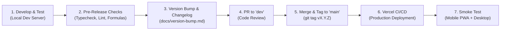

# Release Flow & Deployment Lifecycle

This document describes the branching strategy, verification pipeline, CI/CD automation, and rollback procedures for the **Personal Budget & Wealth Tracker**.

---

## 1. Branching Strategy (Git Flow / Multi-Stage)

We use a clean, production-stable multi-tier branching model:

```
[feature/chewshen] ────────┐
                           ▼
  dev  ────────────────────●──────────────┐ (Staging & Integration)
                                          ▼
  main ───────────────────────────────────●───────────► (Production)
                                          ▲
                                          │
                                    Git Tag: v0.2.0
                                    Auto-deploy to Vercel
```

* **`main`**: The production branch. Every commit on `main` is production-ready and automatically triggers a live deployment on Vercel.
* **`dev`**: The integration branch. Features are merged here via Pull Requests for staging verification before promoting to `main`.
* **Feature Branches (`chewshen`, `feat/<name>`)**: Active working branches for development.
* **Fix Branches (`fix/<bug-name>`)**: Targeted patches and bug fixes.
* **Hotfix Branches (`hotfix/<issue>`)**: Emergency production fixes branched directly from `main`.

---

## 2. Release Lifecycle Stages



---

## 3. Pre-Release Verification Checklist

Before opening a PR or tagging a release, execute this verification sequence:

```bash
npm run type-check              # Strict TypeScript type safety (tsc --noEmit)
npm run lint                    # ESLint code quality rules
node scripts/test_formulas.mjs  # Mathematical parity test against Excel ground truth
npm run build                   # Next.js production build verification
```

### Checklist Criteria:
- [x] **Type Safety**: `npm run type-check` passes with zero errors.
- [x] **Linting**: `npm run lint` passes without warnings or errors.
- [x] **Formula Integrity**:
  - [x] Daily average spend correctly filters out `is_one_off = true`.
  - [x] Salary deductions match exact Malaysian rates (`EPF = 11%`, `SOCSO = 17.25`, `EIS = 6.90`).
  - [x] Interest calculation correctly compounds for month day count (`28-31`).
- [x] **Production Build**: `npm run build` completes successfully.
- [x] **Mobile Responsiveness**:
  - [x] Mobile viewport verified (iPhone Safari & Android Chrome dimensions).
  - [x] Tactile numpad modal opens and closes smoothly.
- [x] **Changelog**: `docs/changelog.md` updated with release notes under the new version header.

---

## 4. Deployment Pipeline (CI/CD)

### Continuous Integration
On every pull request to `dev` or `main`:
1. Clean install dependencies (`npm ci`).
2. Run ESLint.
3. Run TypeScript typecheck.
4. Run Next.js build.

### Continuous Deployment (Vercel)
* Merging to `main` triggers a production deployment on Vercel.
* Vercel builds edge routes and static assets.
* Deployment completes in under 60 seconds with **Zero-Downtime**.

---

## 5. Post-Release Verification (Smoke Testing)

After Vercel reports successful deployment:

1. **Desktop Smoke Test**:
   * Open the production URL in Chrome / Edge.
   * Verify the Monthly Cockpit displays correct KPIs and Recharts visuals.
   * Switch months to verify dynamic recalculation.
   * Add a test transaction $\to$ verify it appears in the ledger $\to$ delete test transaction.
2. **Mobile PWA Smoke Test**:
   * Open the PWA on your phone.
   * Tap the Quick-Add **"+"** button.
   * Log an expense (e.g. `Lunch RM 12.00`).
   * Confirm optimistic UI update and background Supabase cloud sync.

---

## 6. Rollback & Disaster Recovery Procedures

### Instant Frontend Rollback (< 30 seconds)
1. Go to the [Vercel Dashboard](https://vercel.com).
2. Navigate to **Deployments**.
3. Locate the previous stable deployment.
4. Click `...` $\to$ **Instant Rollback**.
5. The previous working version is restored immediately worldwide.

### Database Backups
* **Automated Cloud Backups**: Managed by Supabase.
* **Manual Snapshot**: Back up data before major schema migrations:
  ```bash
  npm run export:csv  # or download CSV backup directly from web app
  ```
