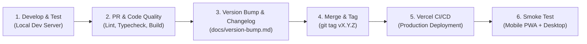

# Release Flow & Deployment Lifecycle

This document describes the branching strategy, testing pipeline, CI/CD automation, and rollback procedures for the **Personal Budget & Wealth Tracker**.

---

## 1. Branching Strategy (GitHub Flow)

We use a lightweight, production-stable **GitHub Flow** model:

```
[feat/mobile-quick-add] ──────┐
                             ▼
  main  ─────────────────────●─────────────────●────────────► (Production)
                             ▲                 ▲
[fix/interest-calc] ─────────┘                 │
                                               ▼
                                      Git Tag: v0.2.0
                                      Auto-deploy to Vercel
```

* **`main`**: The primary branch. Every commit on `main` is production-ready and automatically triggers a build on Vercel.
* **Feature Branches (`feat/<feature-name>`)**: Used for developing new capabilities (e.g. `feat/quick-add`, `feat/recharts-view`).
* **Fix Branches (`fix/<bug-name>`)**: Used for bug fixes and patches.
* **Hotfix Branches (`hotfix/<issue>`)**: Direct emergency fixes merged into `main`.

---

## 2. Release Lifecycle Stages



---

## 3. Pre-Release Verification Checklist

Before tagging any release, perform this standard sanity check:

- [ ] **Type Safety**: `npm run type-check` (or `npx tsc --noEmit`) passes with zero errors.
- [ ] **Linting**: `npm run lint` passes without warnings.
- [ ] **Production Build**: `npm run build` completes successfully.
- [ ] **Formula Integrity**:
  - [ ] Daily average spend correctly filters out `is_one_off = true`.
  - [ ] Salary deductions match exact Malaysian rates (`EPF = 11%`, `SOCSO = 17.25`, `EIS = 6.90`).
  - [ ] Interest calculation correctly accounts for month day count (`28-31`).
- [ ] **Mobile Responsiveness**:
  - [ ] Mobile viewport tested (iPhone Safari & Android Chrome dimensions).
  - [ ] Numpad modal opens smoothly and input closes on save.
- [ ] **Changelog**: `docs/changelog.md` updated with the release notes under the new version header.

---

## 4. Deployment Pipeline (CI/CD)

### Continuous Integration (GitHub Actions)
On every pull request to `main`, GitHub Actions automatically executes:
1. `npm ci` (clean install of locked dependencies).
2. ESLint check.
3. TypeScript compiler validation.
4. Next.js build verification.

### Continuous Deployment (Vercel)
* Merging to `main` triggers a Vercel production deployment.
* Vercel builds the edge routes and static assets.
* Deployment completes in under 60 seconds with **Zero-Downtime**.

---

## 5. Post-Release Verification (Smoke Testing)

After Vercel reports successful deployment:

1. **Desktop Smoke Test**:
   * Open the production URL in Chrome / Edge.
   * Verify the Monthly Cockpit loads with accurate KPIs.
   * Switch months to verify dynamic recalculation.
   * Add a test transaction $\to$ verify it appears in the ledger $\to$ delete test transaction.
2. **Mobile PWA Smoke Test**:
   * Open the PWA on your phone.
   * Tap the Quick-Add **"+"** button.
   * Log an expense (e.g. `Lunch RM 12.00`).
   * Confirm the phone vibration/feedback, optimistic UI update, and that the balance updates instantly.

---

## 6. Rollback & Disaster Recovery Procedures

If a critical bug makes it to production, follow these steps:

### Instant Frontend Rollback (< 30 seconds)
1. Go to the [Vercel Dashboard](https://vercel.com).
2. Navigate to **Deployments**.
3. Locate the previous stable deployment.
4. Click the three dots menu `...` $\to$ **Instant Rollback**.
5. The previous working version is restored immediately worldwide without needing a Git revert commit.

### Git Hotfix Workflow
If the issue requires a code fix:
1. Branch from `main`: `git checkout -b hotfix/fix-broken-calculation`.
2. Apply the fix and verify locally.
3. Bump the patch version: `npm version patch`.
4. Update `docs/changelog.md` under a new patch release.
5. Merge back to `main` and push tags:
   ```bash
   git push origin main --follow-tags
   ```

### Database Safety & Backups
* **Automated Daily Backups**: Managed by Supabase.
* **Manual Snapshot**: Before running any major database schema migration:
  ```bash
  supabase db dump -f backup_$(date +%Y%m%d).sql
  ```
* **Point-in-Time Recovery**: Accessible directly from the Supabase dashboard under Database Backups.
