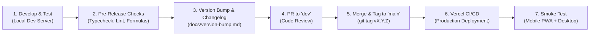

# Release Flow & Deployment Lifecycle

This document describes the branching strategy, verification pipeline, CI/CD automation, and rollback procedures for the **Personal Budget & Wealth Tracker**.

---

## 1. Branching Strategy (Git Flow / Multi-Stage)

We use a clean, production-stable multi-tier branching model:

```
[feature/chewshen] ────────┐
                           ▼
  dev  ────────────────────●──────────────┐ (Staging & Integration)
                                          ▼
  main ───────────────────────────────────●───────────► (Production)
                                          ▲
                                          │
                                    Git Tag: v0.2.0
                                    Auto-deploy to Vercel
```

* **`main`**: The production branch. Every commit on `main` is production-ready and automatically triggers a live deployment on Vercel.
* **`dev`**: The integration branch. Features are merged here via Pull Requests for staging verification before promoting to `main`.
* **Feature Branches (`chewshen`, `feat/<name>`)**: Active working branches for development.
* **Fix Branches (`fix/<bug-name>`)**: Targeted patches and bug fixes.
* **Hotfix Branches (`hotfix/<issue>`)**: Emergency production fixes branched directly from `main`.

---

## 2. Release Lifecycle Stages


```mermaid
flowchart LR
    A["1. Develop & Test<br/>(Local Dev Server)"] --> B["2. Pre-Release Checks<br/>(Typecheck, Lint, Formulas)"]
    B --> C["3. Version Bump & Changelog<br/>(docs/version-bump.md)"]
    C --> D["4. PR to 'dev'<br/>(Code Review)"]
    D --> E["5. Merge & Tag to 'main'<br/>(git tag vX.Y.Z)"]
    E --> F["6. Vercel CI/CD<br/>(Production Deployment)"]
    F --> G["7. Smoke Test<br/>(Mobile PWA + Desktop)"]
```

---

## 3. Pre-Release Verification Checklist

Before opening a PR or tagging a release, execute this verification sequence:

```bash
npm run type-check   # Strict TypeScript type safety (tsc --noEmit)
npm run lint         # ESLint (flat config in eslint.config.mjs)
npm test             # All tests (Vitest, see "Tests" below)
npm run build        # Next.js production build verification
```

### Checklist Criteria:
- [x] **Type Safety**: `npm run type-check` passes with zero errors.
- [x] **Linting**: `npm run lint` passes without warnings or errors.
- [x] **Tests**: `npm test` passes (logic and Excel formula parity, receipt reading, `/api/ingest`, database migrations and RLS).
- [x] **Production Build**: `npm run build` completes successfully.
- [x] **Mobile Responsiveness**:
  - [x] Mobile viewport verified (iPhone Safari & Android Chrome dimensions).
  - [x] Tactile numpad modal opens and closes smoothly.
- [x] **Changelog**: `docs/changelog.md` updated with release notes under the new version header.

---

## 4. Deployment Pipeline (CI/CD)

### Continuous Integration (GitHub Actions)
[`.github/workflows/ci.yml`](../.github/workflows/ci.yml) runs on every push to `chewshen`, `dev` and `main`, and on every pull request to `dev` or `main`:
1. Clean install dependencies (`npm ci`, Node 22).
2. TypeScript type-check.
3. ESLint.
4. Tests (`npm test`); Vercel never runs these.
5. Production build, with placeholder Supabase values (no secrets in CI).

A failing step shows a red ❌ on the commit and the PR. Don't merge until it's green.

### Tests
Vitest, in [`tests/`](../tests/), about a second for the lot:
- `tests/logic.test.ts`: forecast, budgets, bills and auto-add, instalments (terms in whole sen, amount owed), reminders, the Add expense date, savings, goals, and the salary and interest formulas against the original Excel results.
- `tests/ingest.test.ts`: reading TnG receipts, success screens and transfers (amount, payee, date, time, reference), and merchant rules. Example text uses made-up names and numbers only.
- `tests/ingest-endpoint.test.ts`: `/api/ingest` with a stand-in database: token errors, duplicates, the Inbox cap and the notification text.
- `tests/db/`: an in-memory Postgres ([PGlite](https://pglite.dev)) with stand-ins for Supabase's roles, `auth.users`, `auth.uid()` and pg_cron. It builds the database as a real one was built (the README's initial tables, an example spreadsheet import, `secure_rls.sql`, then every migration in the README's order), runs the migrations a second time, and then signs in as two accounts to check that neither can see, change or point at the other's data.

New migration? Add it to the README's Migrations list; the database tests pick it up from there. New table? Add it to `OWNED_TABLES` in `tests/db/database.test.ts` so the privacy checks cover it.

### Continuous Deployment (Vercel)
* Every push builds on Vercel; the build also type-checks and lints, so a broken build never goes live.
* Pushes to `main` deploy to production; other branches (`dev`, `chewshen`) get a preview URL.
* Preview deployments use the **same Supabase project** as production, so test data entered there is real data.
* Environment variables are set in Vercel → Settings → Environment Variables: `NEXT_PUBLIC_SUPABASE_URL`, `NEXT_PUBLIC_SUPABASE_ANON_KEY`, and for reminders `NEXT_PUBLIC_VAPID_PUBLIC_KEY`, `VAPID_PRIVATE_KEY`, `SUPABASE_SERVICE_ROLE_KEY` (the Supabase **secret** key, `sb_secret_…`) and `CRON_SECRET` (see README → Reminders). `NEXT_PUBLIC_` values are baked in at build time, so changing one needs a redeploy.
* **Database migrations are run by hand** in the Supabase SQL Editor, in the order the README lists them, before or right after the deploy that needs them. The app tolerates a missing migration (it says which file to run), so the order is forgiving.

---

## 5. Post-Release Verification (Smoke Testing)

After Vercel reports successful deployment:

1. **Desktop Smoke Test**:
   * Open the production URL in Chrome / Edge.
   * Verify the Monthly Cockpit displays correct KPIs and Recharts visuals.
   * Switch months to verify dynamic recalculation.
   * Add a test transaction $\to$ verify it appears in the ledger $\to$ delete test transaction.
2. **Mobile PWA Smoke Test**:
   * Open the PWA on your phone.
   * Tap the Quick-Add **"+"** button.
   * Log an expense (e.g. `Lunch RM 12.00`).
   * Confirm optimistic UI update and background Supabase cloud sync.

---

## 6. Rollback & Disaster Recovery Procedures

### Instant Frontend Rollback (< 30 seconds)
1. Go to the [Vercel Dashboard](https://vercel.com).
2. Navigate to **Deployments**.
3. Locate the previous stable deployment.
4. Click `...` $\to$ **Instant Rollback**.
5. The previous working version is restored immediately worldwide.

### Database Backups
* **Supabase Free plan has no automatic backups** (daily backups start on the Pro plan). Take manual backups before schema changes.
* **Transactions**: Overview → **Export** downloads all transactions as CSV.
* **In the app**: Overview → **Export** → **Full backup** downloads everything for your account (expenses, savings accounts and balances, categories, bills, goals, salary) as JSON.
* **Everything, all accounts**: Supabase Dashboard → Table Editor → each table → **Export to CSV**, or with the database connection string from Dashboard → Connect:
  ```bash
  pg_dump "$DATABASE_URL" --schema=public --data-only > backup-$(date +%F).sql
  ```
